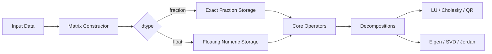

how to build

```bash
cmake -S . -B build
cmake --build build
```

---

# MatLibrary

[](https://www.python.org/)
[](#feature-map)
[](#notes-and-limitations)

A compact yet full-featured linear algebra toolkit in pure Python, built around one unified `Matrix` class.

It is designed for coursework, algorithm learning, and small experiments where readability and mathematical transparency matter.

## Navigation

- [MatLibrary](#matlibrary)
  - [Navigation](#navigation)
  - [Why MatLibrary](#why-matlibrary)
  - [Feature Map](#feature-map)
  - [Architecture At A Glance](#architecture-at-a-glance)
  - [Quick Start](#quick-start)
    - [SVD Example](#svd-example)
  - [Method Recommendations](#method-recommendations)
  - [API Snapshot](#api-snapshot)
    - [Construction](#construction)
    - [Common Operations](#common-operations)
    - [Linear Algebra](#linear-algebra)
    - [Global Helpers](#global-helpers)
  - [Detailed Documentation](#detailed-documentation)
  - [Notes and Limitations](#notes-and-limitations)

## Why MatLibrary

- Unified architecture: one class, one mental model (`data`, `dim`, `dtype`, `tolerance`).
- Dual arithmetic modes:
  - `dtype="fraction"` for exact rational computations.
  - `dtype="float"` for decomposition-heavy numerical workflows.
- Broad method coverage from basic algebra to SVD and Jordan form.
- Algorithm comparison mindset built in (`Matrix.method_comparison()`).

## Feature Map

| Domain | Main Methods | Notes |
|---|---|---|
| Basic Ops | `+`, `-`, `*`, `@`, `**`, slicing | Matrix arithmetic and indexing |
| Core LA | `gauss_elimination`, `determinant`, `inverse`, `rank` | Pivoting-aware elimination pipeline |
| Factorization | `lu_decomposition`, `cholesky_decomposition`, `qr_decomposition` | LU with optional pivoting, SPD Cholesky |
| Eigen | `eigenpairs_jacobi`, `eigenvalues_qr`, `eigenpairs` | Symmetric-first Jacobi + general QR iteration |
| SVD | `svd`, `singular_value_decomposition` | Uses $A^TA$ eigen route + orthonormal completion |
| Canonical Form | `jordan_normal_form` | Exact rational-eigenvalue path |

## Architecture At A Glance



## Quick Start

```python
from matlibrary import Matrix

A = Matrix(data=[[1, 2], [3, 4]], dtype="fraction")
B = Matrix(data=[[5, 6], [7, 8]], dtype="fraction")

print(A + B)
print(A * B)
```

### SVD Example

```python
from matlibrary import Matrix

A = Matrix(data=[[3, 2, 2], [2, 3, -2]], dtype="float")
U, Sigma, V_T = A.svd()
A_reconstructed = U * Sigma * V_T

print(A_reconstructed)
```

## Method Recommendations

| Task | Recommended Method | Reason |
|---|---|---|
| Elimination / determinant / inverse | Pivoting enabled | Better numerical robustness |
| QR decomposition | Householder (`method="householder"`) | Most stable default in this library |
| Symmetric eigen problem | Jacobi | Stable, orthonormal eigenvectors |
| General eigenvalues | QR iteration | More general applicability |
| SVD | Built-in `svd()` route | Consistent singular-vector pairing |

## API Snapshot

### Construction

- `Matrix(data=None, dim=None, init_value=0, tolerance=1e-10, dtype="fraction")`
- `Matrix.identity(n, tolerance=1e-10, dtype="fraction")`

### Common Operations

- `shape()`, `copy()`, `reshape(newdim)`
- `transpose()`, `T()`
- `sum(axis=None)`
- `concatenate(other, index=0)`
- `kronecker_product(other)`

### Linear Algebra

- `gauss_elimination(pivoting=True)`
- `determinant()` / `det()`
- `inverse()`
- `rank()`
- `lu_decomposition(pivoting=True)`
- `cholesky_decomposition()`
- `qr_decomposition(method="householder")`
- `eigenpairs(...)`, `eigenvalues(...)`
- `svd()` / `singular_value_decomposition()`
- `jordan_normal_form()`

### Global Helpers

- `I(n, tolerance=1e-10, dtype="fraction")`
- `concatenate(items, axis=0)`

## Detailed Documentation

- English full documentation: `README_en.md`
- Chinese full documentation: `README_cn.md`

## Notes and Limitations

- This is a teaching-oriented implementation, not a performance replacement for NumPy/SciPy.
- Jordan form is currently implemented for the rational-eigenvalue exact path.
- QR eigenvalue iteration is an unshifted educational variant.
